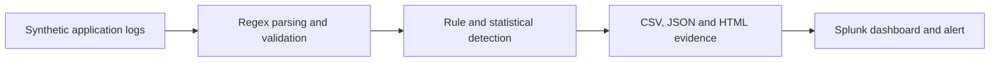
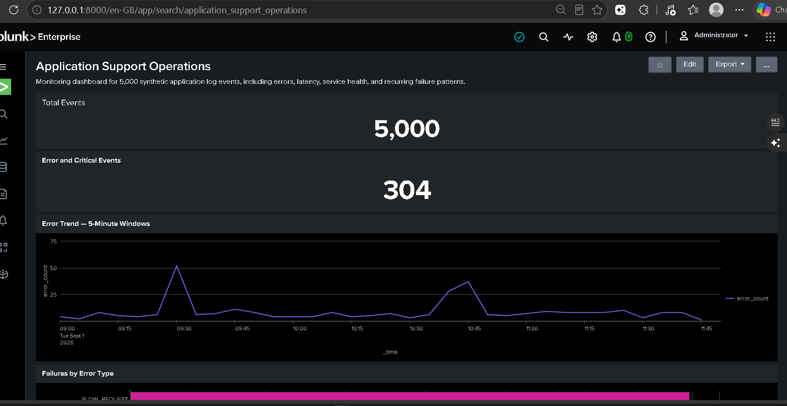
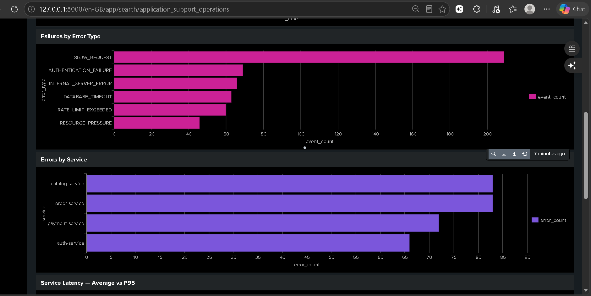
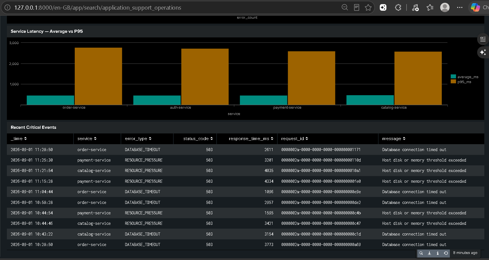
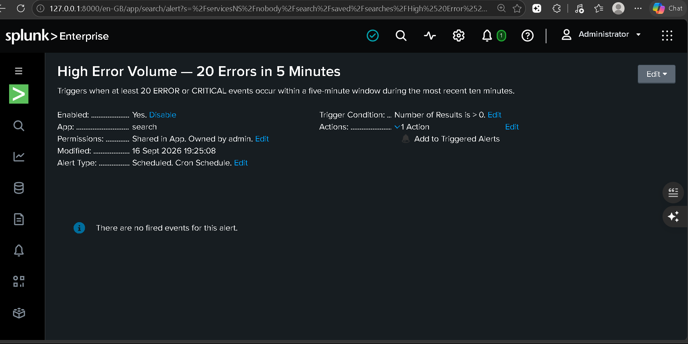

# Log Anomaly Detection & Incident Monitoring System

A reproducible application-support project for parsing structured logs, detecting operational anomalies, investigating failure patterns, and visualizing service health in Splunk.

The project processes 5,000 deterministic synthetic application events using Python, regular expressions, and pandas. It combines rule-based detection with rolling statistical baselines, exports investigation-ready evidence, publishes a browser-based operations report, and provides a Splunk dashboard with a scheduled error-volume alert.

[View the live operations report](https://anjalisingh127.github.io/log-anomaly-detector/) ·
[Read the incident runbook](docs/incident-runbook.md) ·
[Review the Splunk setup](splunk/docker-setup.md)

> The dataset is synthetic and contains no production, customer, or personal data. Results describe this controlled dataset and must not be interpreted as production impact.

## Why I built this

Application-support engineers frequently need to answer questions such as:

- When did an incident begin?
- Which service or host was affected?
- Did the error volume exceed its normal baseline?
- Which failure categories occur most frequently?
- Which requests were slow or returned HTTP 5xx responses?
- What evidence should be recorded before escalation?

I built this project to practise that workflow end to end: generate reproducible application activity, parse and validate logs, detect abnormal behaviour, investigate evidence in Splunk, and document repeatable resolution steps.

## Verified results

The current configuration uses seed `42`, so the dataset and results can be reproduced.

| Metric | Verified result |
|---|---:|
| Synthetic log events generated | 5,000 |
| Successfully parsed records | 5,000 |
| Malformed records | 0 |
| `ERROR` or `CRITICAL` events | 304 |
| `CRITICAL` events | 20 |
| `WARNING` events | 209 |
| Rule detections | 1,009 |
| Statistically flagged five-minute windows | 3 |
| Automated tests | 18 passed |
| Median scripted runtime | 0.123698 seconds over 7 runs |

A single event may satisfy multiple rules—for example, an event can simultaneously be an `ERROR`, an HTTP 5xx response, a database timeout, and a slow request. Therefore, the 1,009 rule detections are intentionally not presented as 1,009 unique incidents.

The three statistically flagged windows result from the configured anomaly intervals crossing five-minute aggregation boundaries.

## System workflow



1. `scripts/generate_logs.py` creates deterministic, Splunk-friendly application logs.
2. The parser extracts and validates timestamps, severity, service, host, request ID, endpoint, status code, response time, error type, and message.
3. Malformed records are isolated with their line number, failure reason, and original evidence.
4. Detection rules identify severity events, HTTP 5xx responses, slow requests, database timeouts, and authentication-failure sequences.
5. pandas aggregates events into five-minute windows.
6. A rolling baseline and z-score identify unusual error-volume increases.
7. Results are exported for investigation through CSV, JSON, HTML, and Splunk.

## Detection approach

The detector uses explainable rules and configurable thresholds rather than an opaque model.

| Detection | Default logic |
|---|---|
| Severity event | `level` is `ERROR` or `CRITICAL` |
| HTTP server failure | Status code from 500 through 599 |
| Slow request | Response time of at least 1,500 ms |
| Database timeout | Categorized database-timeout event |
| Authentication sequence | At least 5 consecutive authentication failures |
| Error spike | Five-minute count exceeds a six-window rolling baseline with z-score ≥ 2.5 |

Zero-variance baselines are handled explicitly to avoid division errors and misleading infinite scores.

Configuration is stored in [`config/config.yaml`](config/config.yaml).

## Failure patterns represented

The synthetic dataset models four services and four application hosts, with operational patterns including:

- Slow requests
- Authentication failures
- Internal server errors
- Database timeouts
- API rate-limit violations
- Disk or memory pressure

The incident runbook documents root-cause indicators, investigation searches, containment guidance, escalation evidence, and resolution steps for the five primary incident categories.

## Splunk operations dashboard

The generated logs were ingested into a local Splunk Enterprise 10.4.3 instance running in Docker. The dashboard includes:

- Total event volume
- Error and critical-event count
- Five-minute error trend
- Failure counts by error type
- Error counts by service
- Average and P95 service latency
- Recent critical events with request-level evidence

### Operations overview



### Service diagnostics



### Critical-event investigation



The reusable dashboard definition is available in
[`splunk/application-support-operations.xml`](splunk/application-support-operations.xml).

## Scheduled alert

The saved Splunk alert runs every five minutes and examines the most recent ten minutes. It produces a result when any five-minute window contains at least 20 `ERROR` or `CRITICAL` events.

```spl
index=app_support level IN ("ERROR","CRITICAL")
| bin _time span=5m
| stats count AS error_count by _time
| where error_count >= 20
```



The exported alert configuration is available in
[`splunk/savedsearches.conf`](splunk/savedsearches.conf).

The demonstration uses historical synthetic events, so the live alert is expected to remain dormant unless new events cross the configured threshold. Scheduled alerting works during the Splunk Enterprise Trial and stops if the installation converts to a license that does not support scheduled alerts.

## Public operations report

The analysis command generates a self-contained HTML report with no external JavaScript dependencies. It includes:

- Operational summary cards
- Error counts by five-minute window
- Failure categories
- Errors by service and application host
- Detection thresholds
- Synthetic-data disclosure

[Open the published report](https://anjalisingh127.github.io/log-anomaly-detector/)

The report can also be regenerated locally as `docs/index.html`.

## Quick start

### Prerequisites

- Python
- Git
- Docker Desktop, only if running Splunk

### Python setup

```bash
git clone https://github.com/Anjalisingh127/log-anomaly-detector.git
cd log-anomaly-detector

python -m venv .venv
```

Activate the environment on Windows PowerShell:

```powershell
.\.venv\Scripts\Activate.ps1
```

Activate it on Linux or macOS:

```bash
source .venv/bin/activate
```

Install the project:

```bash
python -m pip install --upgrade pip
python -m pip install -r requirements.txt
python -m pip install -e .
```

### Generate the dataset

```bash
python scripts/generate_logs.py
```

Expected output with the default configuration:

```text
Generated 5000 events at data/sample_application.log (304 errors, 20 critical, 209 warnings).
```

### Parse the logs

```bash
python -m log_anomaly_detector.cli parse \
  --input data/sample_application.log \
  --output reports
```

On Windows PowerShell:

```powershell
python -m log_anomaly_detector.cli parse `
    --input data\sample_application.log `
    --output reports
```

### Run anomaly detection and generate the report

```bash
python -m log_anomaly_detector.cli analyze \
  --input data/sample_application.log \
  --output reports \
  --config config/config.yaml \
  --html-report docs/index.html
```

On Windows PowerShell:

```powershell
python -m log_anomaly_detector.cli analyze `
    --input data\sample_application.log `
    --output reports `
    --config config\config.yaml `
    --html-report docs\index.html
```

### Run the benchmark

```bash
python scripts/benchmark.py --runs 7
```

The benchmark records scripted execution time. It calculates a time-reduction percentage only when a real, separately measured manual-review duration is supplied.

### Run the tests

```bash
python -m pytest -q
```

Current verified result:

```text
18 passed
```

## Run Splunk with Docker

Create the local environment file:

```powershell
Copy-Item .env.example .env
notepad .env
```

Set a strong local Splunk administrator password in `.env`. The file is ignored by Git and must never be committed.

Validate and start the container:

```powershell
docker compose config --quiet
docker compose up -d
docker compose ps
```

Wait until the container reports `healthy`, then open:

```text
http://127.0.0.1:8000
```

The configuration:

- Pins the official `splunk/splunk:10.4.3` image
- Binds Splunk Web only to `127.0.0.1:8000`
- Persists Splunk data and configuration in Docker volumes
- Mounts the generated log file as read-only
- Keeps credentials outside version control

See the complete [Splunk Docker setup guide](splunk/docker-setup.md).

To stop Splunk without deleting its data:

```powershell
docker compose stop
```

Do not use `docker compose down -v` unless you intentionally want to delete the persistent Splunk volumes.

## Project structure

```text
log-anomaly-detector/
├── config/                         Detection and generator configuration
├── data/                           Synthetic log data and dataset notes
├── docs/                           Public report, evidence and runbooks
│   └── images/                     Splunk dashboard and alert screenshots
├── reports/                        Generated CSV and JSON evidence
├── scripts/
│   ├── benchmark.py                Repeatable execution benchmark
│   └── generate_logs.py            Deterministic log generator
├── splunk/
│   ├── application-support-operations.xml
│   ├── savedsearches.conf
│   └── docker-setup.md
├── src/log_anomaly_detector/
│   ├── cli.py                      Command-line interface
│   ├── detector.py                 Rules and statistical detection
│   ├── parser.py                   Parsing and validation
│   └── reporter.py                 HTML report generation
├── tests/                           Automated test suite
├── compose.yaml                     Local Splunk environment
├── pyproject.toml
└── requirements.txt
```

Generated outputs that may be excluded from version control can be reproduced from the source dataset and configuration.

## Incident-response documentation

- [Application-support incident runbook](docs/incident-runbook.md)
- [Reusable incident-note template](docs/incident-note-template.md)
- [Worked synthetic incident](docs/sample-incident.md)
- [Performance methodology](docs/performance-methodology.md)
- [Architecture](docs/architecture.md)
- [Local setup guide](docs/setup-guide.md)
- [Dataset notes](data/README.md)

## Design decisions

- **Deterministic generation:** Seeded data makes tests, demonstrations, and comparisons reproducible.
- **Explainable detection:** Every alert includes the rule, threshold, or statistical evidence that produced it.
- **Malformed-record isolation:** Invalid input does not silently disappear or corrupt normalized output.
- **Request correlation:** Request IDs support event tracing across investigation steps.
- **Portable evidence:** CSV, JSON, and HTML outputs can be reviewed without Splunk.
- **Secure local setup:** Passwords remain in an ignored environment file, and Splunk Web binds only to localhost.
- **Measured claims:** Performance claims are reported only when the method and raw evidence exist.

## Current limitations

- The dataset is synthetic and does not demonstrate production reliability or customer impact.
- The dashboard runs locally; the public GitHub Pages report is a separate static representation.
- The scheduled alert remains dormant without newly ingested events.
- Rule thresholds are demonstration defaults and should be calibrated before production use.
- A manual-versus-script review trial has not yet been completed, so no percentage time-saving claim is made.
- The project does not currently send email, Slack, PagerDuty, or ServiceNow notifications.

## Roadmap

- [x] Deterministic synthetic log generator
- [x] Regex parser and schema validation
- [x] Malformed-record isolation
- [x] Rule-based anomaly detection
- [x] Rolling z-score spike detection
- [x] CSV, JSON, and HTML evidence
- [x] Splunk dashboard and saved searches
- [x] Scheduled Splunk error-volume alert
- [x] Five-category incident runbook
- [x] Docker-based Splunk environment
- [x] Public GitHub Pages report
- [x] Dashboard and alert screenshots
- [ ] Measured manual-versus-script timing trial
- [ ] Optional external notification integration

## Ethics and measurement

This project does not claim production impact. The dataset, failures, services, hosts, incidents, and measurements are synthetic.

The recorded scripted runtime is reproducible evidence from the local benchmark. A manual-review reduction percentage will be published only after completing and documenting a comparable manual timing trial.

## License

This project is available under the [MIT License](LICENSE).